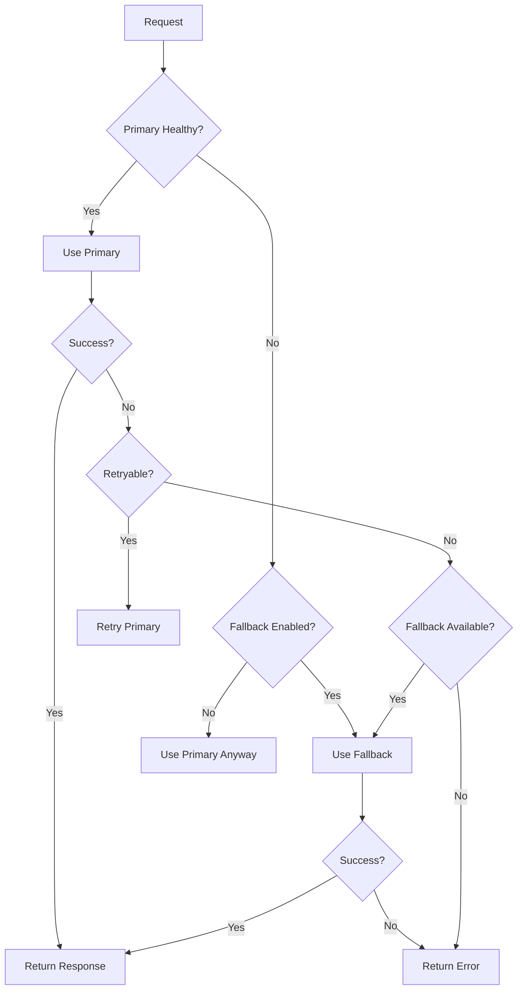

# AI Provider System

A flexible, multi-provider AI system that supports switching between DeepSeek and OpenAI APIs with automatic fallback mechanisms and comprehensive error handling.

## Features

- **Multi-Provider Support**: DeepSeek and OpenAI (ChatGPT) APIs
- **Dynamic Provider Switching**: Runtime switching based on environment variables
- **Automatic Fallback**: Seamless fallback to secondary provider if primary fails
- **Unified Interface**: Consistent API across all providers
- **Robust Error Handling**: Provider-specific error handling with retry mechanisms
- **Health Monitoring**: Real-time health checks for all providers
- **Backward Compatibility**: Seamless migration from existing OpenAI integration

## Quick Start

### 1. Environment Configuration

Add to your `.env` file:

```bash
# Primary provider (deepseek or openai)
AI_PROVIDER="deepseek"

# Enable automatic fallback
AI_ENABLE_FALLBACK="true"

# DeepSeek API
DEEPSEEK_API_KEY="your-deepseek-api-key"

# OpenAI API  
OPENAI_API_KEY="your-openai-api-key"
OPENAI_MODEL="gpt-3.5-turbo"
```

### 2. Basic Usage

```typescript
import { AIProviderFactory } from '@/lib/ai-providers'

// Initialize factory
const factory = AIProviderFactory.fromEnvironment()

// Generate content
const response = await factory.generateContent({
  title: "Sample Title",
  type: "PAGE",
  categories: ["tech", "ai"],
  profile: { prompt: "You are a helpful assistant" },
  wordCount: 500
})

console.log(response.content)
```

### 3. Direct Provider Usage

```typescript
import { DeepSeekProvider, OpenAIProvider } from '@/lib/ai-providers'

// Use specific provider
const provider = new DeepSeekProvider({
  apiKey: 'your-api-key',
  model: 'deepseek-chat'
})

const response = await provider.generateCompletion({
  messages: [
    { role: 'system', content: 'You are a helpful assistant' },
    { role: 'user', content: 'Hello!' }
  ]
})
```

## Architecture

### Core Components

```
lib/ai-providers/
├── types.ts              # TypeScript interfaces and types
├── deepseek-provider.ts   # DeepSeek API implementation  
├── openai-provider.ts     # OpenAI API implementation
├── provider-factory.ts    # Factory with dynamic selection
└── index.ts              # Main exports
```

### Provider Interface

All providers implement the `AIProviderInterface`:

```typescript
interface AIProviderInterface {
  readonly provider: AIProvider
  readonly config: AIProviderConfig
  
  generateCompletion(request: AIGenerationRequest): Promise<AIGenerationResponse>
  checkHealth(): Promise<AIProviderHealthCheck>
  validateConfig(): Promise<boolean>
  getAvailableModels(): string[]
}
```

## Environment Variables

### Core Configuration

| Variable | Description | Default | Required |
|----------|-------------|---------|----------|
| `AI_PROVIDER` | Primary provider (`deepseek` \| `openai`) | `deepseek` | No |
| `AI_ENABLE_FALLBACK` | Enable automatic fallback | `true` | No |

### DeepSeek Configuration

| Variable | Description | Default | Required |
|----------|-------------|---------|----------|
| `DEEPSEEK_API_KEY` | DeepSeek API key | - | Yes* |
| `DEEPSEEK_BASE_URL` | Custom base URL | `https://api.deepseek.com` | No |
| `DEEPSEEK_MODEL` | Model name | `deepseek-chat` | No |

### OpenAI Configuration

| Variable | Description | Default | Required |
|----------|-------------|---------|----------|
| `OPENAI_API_KEY` | OpenAI API key | - | Yes* |
| `OPENAI_MODEL` | Model name | `gpt-3.5-turbo` | No |
| `OPENAI_BASE_URL` | Custom base URL | `https://api.openai.com/v1` | No |

### Optional Settings

| Variable | Description | Default |
|----------|-------------|---------|
| `AI_TIMEOUT` | Request timeout (ms) | `60000` |
| `AI_MAX_RETRIES` | Maximum retry attempts | `3` |

*At least one provider API key is required.

## Provider Selection Logic

### 1. Primary Provider
- Uses `AI_PROVIDER` environment variable
- Falls back to `deepseek` if not specified
- Must have valid API key configured

### 2. Fallback Provider  
- Automatically determined (opposite of primary)
- Only used if `AI_ENABLE_FALLBACK=true`
- Must have valid API key configured

### 3. Health-Based Selection
- Primary provider health is checked before use
- Automatic fallback if primary is unhealthy
- Health results are cached for 5 minutes

## Error Handling

### Provider-Specific Errors

The system provides specific error types for different scenarios:

```typescript
// Authentication errors
AuthenticationError: Invalid API key

// Rate limiting  
RateLimitError: Rate limit exceeded (includes retry-after)

// Quota issues
QuotaExceededError: API quota exceeded

// Network issues
ConnectionError: Network/connection problems (retryable)

// Timeouts
TimeoutError: Request timeout (retryable)
```

### Retry Mechanism

- Exponential backoff with jitter
- Configurable retry attempts (default: 3)
- Only retries on retryable errors
- Different retry strategies per provider

### Fallback Flow



## Health Monitoring

### Health Check Endpoint

```typescript
import { checkAPIHealth, checkAllProvidersHealth } from '@/lib/openai'

// Check primary provider
const health = await checkAPIHealth()
console.log(health.status) // 'healthy' | 'degraded' | 'unhealthy'

// Check all providers
const allHealth = await checkAllProvidersHealth()
console.log(allHealth.providers)
```

### Health Status Criteria

- **Healthy**: Response time < 2s
- **Degraded**: Response time 2-10s  
- **Unhealthy**: Response time > 10s or error

## Migration Guide

### From Existing OpenAI Integration

The system maintains full backward compatibility:

```typescript
// Old code continues to work
import { generateContent, openai } from '@/lib/openai'

// New provider-aware code
import { providerFactory, getCurrentProvider } from '@/lib/openai'
```

### API Route Updates

No changes required in existing API routes:

```typescript
// app/api/generate/route.ts - no changes needed
import { generateContent } from '@/lib/openai'

const content = await generateContent({
  title,
  type, 
  categories,
  profile,
  wordCount,
  extraInstructions
})
```

## Advanced Usage

### Custom Provider Configuration

```typescript
const factory = new AIProviderFactory({
  primary: 'openai',
  fallback: 'deepseek', 
  enableFallback: true,
  configs: {
    openai: {
      model: 'gpt-4',
      temperature: 0.8,
      maxTokens: 4000
    },
    deepseek: {
      model: 'deepseek-coder',
      temperature: 0.5
    }
  }
})
```

### Manual Provider Selection

```typescript
// Force specific provider
const provider = await factory.getProvider('openai')
const response = await provider.generateCompletion(request)

// Check provider capabilities
const models = provider.getAvailableModels()
console.log(models) // ['gpt-4', 'gpt-3.5-turbo', ...]
```

### Health Monitoring Setup

```typescript
// Periodic health checks
setInterval(async () => {
  const health = await checkAllProvidersHealth()
  console.log('Provider Health:', health)
}, 5 * 60 * 1000) // Every 5 minutes
```

## Testing

### Run Test Suite

```bash
node scripts/test-ai-providers.js
```

### Manual Testing

```typescript
// Validate environment
import { validateEnvironment } from '@/lib/openai'

const validation = validateEnvironment()
if (!validation.valid) {
  console.error('Configuration errors:', validation.errors)
}
```

## Troubleshooting

### Common Issues

1. **"Primary provider not available"**
   - Check API key configuration
   - Verify provider name in `AI_PROVIDER`

2. **"No fallback provider configured"**  
   - Set `AI_ENABLE_FALLBACK=true`
   - Configure secondary provider API key

3. **Rate limiting errors**
   - Check API quotas and limits
   - Consider implementing request queuing

4. **Connection timeouts**
   - Increase `AI_TIMEOUT` value
   - Check network connectivity

### Debug Information

```typescript
import { getConnectionStats, getCurrentProvider } from '@/lib/openai'

// Get current configuration
const stats = getConnectionStats()
console.log('Config:', stats)

// Get active provider info
const provider = await getCurrentProvider()
console.log('Provider:', provider)
```

## Performance Considerations

- Health checks are cached for 5 minutes
- Failed providers are marked unhealthy for cache duration
- Retry mechanisms prevent cascading failures
- Exponential backoff reduces server load

## Security

- API keys should be stored securely in environment variables
- Provider selection cannot be influenced by user input
- All requests use secure HTTPS endpoints
- No sensitive data is logged or cached